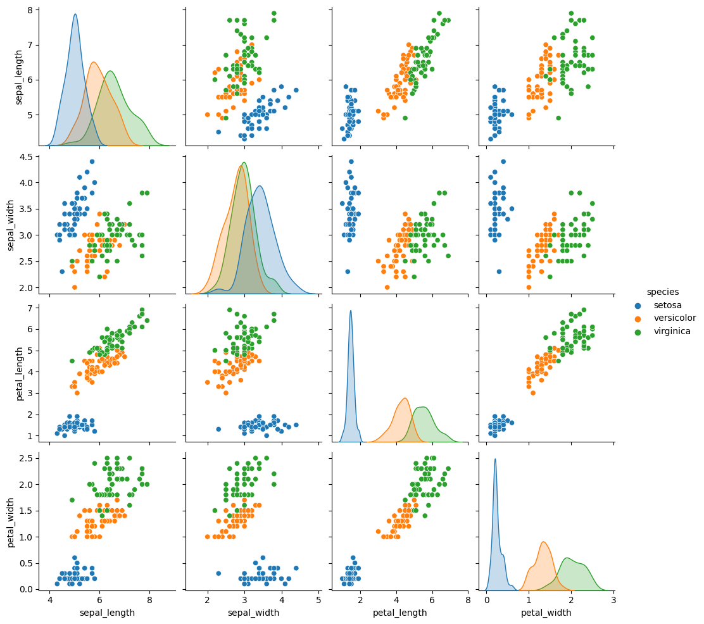

<div style="position: absolute; top: 0; right: 0;">
    <a href="mailto:ertugrulbusiness@gmail.com"></a>
    <a href="https://tr.linkedin.com/in/ertu%C4%9Fruldemir?original_referer=https%3A%2F%2Fwww.google.com%2F"></a>
    <a href="https://github.com/ertugruldmr"></a>
    <a href="https://www.kaggle.com/erturuldemir"></a>
    <a href="https://huggingface.co/ErtugrulDemir"></a>
    <a href="https://stackoverflow.com/users/21569249/ertu%c4%9frul-demir?tab=profile"></a>
    <a href="https://medium.com/@ertugrulbusiness"></a>
    <a href="https://www.youtube.com/channel/UCB0_UTu-zbIsoRBHgpsrlsA"></a>
</div>


# Iris Flowers Species Classification

## __Brief__ 

### __Project__ 
- This is a __classification__ project that uses the well-known __Iris dataset__ to __classify the species__ of iris flowers based on four features.
- The __goal__ is to build a model that accurately __predicts the species__ of a new iris based on these features. 
- The performance of the model is evaluated using several __metrics__, including _accuracy_, _precision_, _recall_, and _F1 score_.
#### __Overview__
- This project involves building a machine learning model to classify iris flowers based on their features. The dataset contains 150 instances with 50 instances for each of the three species of iris flowers. The project uses Python and several popular libraries such as Pandas, NumPy, and Scikit-learn.

#### __Demo__

<div align="left">
  <table>
    <tr>
    <td>
        <a target="_blank" href="https://ertugruldemir-irisflowerspeciesclassification.hf.space">[Demo app] HF Space</a>
      </td>
      <td>
        <a target="_blank" href="https://colab.research.google.com/drive/1gdg116flepyhSYnOqu29Xhn1LxYle2H-">[Demo app] Run in Colab</a>
      </td>
      <td>
        <a target="_blank" href="https://github.com/tensorflow/docs/blob/master/site/en/tutorials/images/classification.ipynb">[Traning pipeline] source on GitHub</a>
      </td>
    <td>
        <a target="_blank" href="https://colab.research.google.com/drive/12FTZcd7ukHNaugJeeQJQSiB_5Ct5UkjB">[Traning pipeline] Run in Colab</a>
      </td>
    </tr>
  </table>
</div>


- Description
    - __classify the species__ of iris flowers based on four features.
    - __Usage__: Set the feature values through sliding the radio buttons then use the button to predict.
- Embedded [Demo](https://ertugruldemir-irisflowerspeciesclassification.hf.space) window from HuggingFace Space
    

<iframe
	src="https://ertugruldemir-irisflowerspeciesclassification.hf.space"
	frameborder="0"
	width="850"
	height="450"
></iframe>


#### __Data__
- The [Iris dataset](https://archive.ics.uci.edu/ml/datasets/iris) is included in the seaborn library and can be loaded directly into a Pandas DataFrame. 
- The dataset contains four numerical features and a target variable with three classes.
- The dataset contains the following features:
<table>
<tr><th>Data Info </th><th><div style="padding-left: 50px;">Stats</div></th></tr>
<tr><td>

| Index | Column       | Non-Null Count | Dtype   |
|-------|--------------|----------------|---------|
| 0     | sepal_length | 150            | float64 |
| 1     | sepal_width  | 150            | float64 |
| 2     | petal_length | 150            | float64 |
| 3     | petal_width  | 150            | float64 |
| 4     | species      | 150            | object  |

</td><td>

<div style="flex: 50%; padding-left: 50px;">

|             | count | mean     | std      | min | 25%  | 50%  | 75%  | max |
|-------------|-------|----------|----------|-----|-------|-------|-------|-----|
| sepal_length | 150   | 5.843333 | 0.828066 | 4.3 | 5.1   | 5.80  | 6.4   | 7.9 |
| sepal_width  | 150   | 3.057333 | 0.435866 | 2.0 | 2.8   | 3.00  | 3.3   | 4.4 |
| petal_length | 150   | 3.758000 | 1.765298 | 1.0 | 1.6   | 4.35  | 5.1   | 6.9 |
| petal_width  | 150   | 1.199333 | 0.762238 | 0.1 | 0.3   | 1.30  | 1.8   | 2.5 |
</div>

</td></tr> </table>

<div style="text-align: center;">
    
</div>

#### Problem
- It is a classification problem. __classify the species__ of iris flowers based on four features.
#### Goal and Solving approach
- The __goal__ is to build a model that accurately __predicts the species__ of a new iris based on these features.

- __Solving approach__ is that using the supervised machine learning models (linear, non-linear, ensemly) on the dataset through convenient processes.

#### Study
The project aimed classifying the species using the features. The study includes following chapters.
- __(A) Dependencies__: Installations and imports of the libraries.
- __(B) Dataset__: Downloading and loading the dataset
- __(C) Pre-processing__: It includes data type casting, missing value hadnling, outlier handling.
- __(D) Exploratory Data Analysis__: Univariate, Bivariate, Multivariate anaylsises. Correlation and other relations.
- __(E) Modelling__: Model tuning via GridSearch on Linear, Non-linear, Ensemble Models. 
- __(F) Saving the project__: Saving the project and demo studies.
- __(G) Deployment as web demo app__: Creating Gradio Web app to Demostrate the project.Then Serving the demo via huggingface as live.

#### results
- The final model is __logistic regression__ because of the results and less complexity.
    -  So we can classify the species with %97 accuracy, precision, recall, f1_score.
<div style="flex: 50%; padding-left: 80px;">

|   | accuracy | precision | recall | f1_score |
|---|---------|-----------|--------|----------|
| loj_reg | 0.966667 | 0.966667 | 0.966667 | 0.966667 |
</div> 

- Model tuning results are below.

<table>
<tr><th>Linear Model Tuning Results</th></tr>
<tc><td>


|              | MaxError | MeanAbsoluteError | MeanAbsolutePercentageError |   MSE   |   RMSE  |    MAE   |    R2    | ExplainedVariance |
|:------------|:-------:|:----------------:|:----------------------------:|:-------:|:-------:|:--------:|:--------:|:-----------------:|
|   l1_reg    |   1.0   |        0.0       |          9.523810           | 0.100000 | 0.316228 | 0.100000 | 0.841828 |      0.843585      |
|   l2_reg    |   1.0   |        0.0       |         14.285714           | 0.133333 | 0.365148 | 0.133333 | 0.789104 |      0.789104      |
|  enet_reg   |   1.0   |        0.0       |          9.523810           | 0.100000 | 0.316228 | 0.100000 | 0.841828 |      0.843585      |
|   lin_reg   | 0.894552|     0.066667     |         0.066667            |   1.0   |   0.0   | 7.142857 | 0.894552 |      0.258199      |


</td><td> </table>


<table>
<tr><th>Non-Linear Model Tuning Results</th><th><div style="padding-left: 175px;">Ensemble Model Tuning Results</div></th></tr>

<tr><td>

|  Model  | accuracy | precision |  recall  | f1_score |
| --- | :------: | :-------: | :------: | :------: |
| loj_reg |  0.966667  |  0.966667  |  0.966667  |  0.966667  |
| nb_params |  0.9  |  0.9  |  0.9  |  0.9  |
| knn |  0.933333  |  0.933333  |  0.933333  |  0.933333  |
| svc |  0.933333  |  0.933333  |  0.933333  |  0.933333  |
| dt |  0.9  |  0.9  |  0.9  |  0.9  |


</td><td>
<div style="flex: 50%; padding-left: 175px;">


|  Model  | accuracy | precision |  recall  | f1_score |
|--------|----------|-----------|----------|----------|
|   rf   |   0.9    |    0.9    |    0.9   |    0.9   |
|   gbc  |   0.9    |    0.9    |    0.9   |    0.9   |
|  xgbc  |   0.9    |    0.9    |    0.9   |    0.9   |
|  lgbm  |   0.9    |    0.9    |    0.9   |    0.9   |
|   cb   |   0.9    |    0.9    |    0.9   |    0.9   |

</div>

</td></tr> </table>


## Details (don't forget using the metrics but DETAILED)
### Table Of content
### Introduction
#### Abstract
- Iris Flowers Dataset is used to classifying the species of the flowers. The dataset has 50 records per class as 150 records with 3 target class. The problem is supervised learning task as multiple class classification. The goal is the predicting the species of the flowers correctly through using supervised machine learning algorithms such as non-linear, ensemble and smilar classic machine learning model.The study includes creating the environment, getting the data, preprocessing the data, exploring the data, modelling the data, saving the results, deployment as demo app. Training phase of the models implemented through cross validation and Grid Search model tuning approachs. Hyperparameter tuning implemented Greedy Greed Search approach which tunes a hyper param at once a time while iterating the sorted order according the importance of the hyperparams. Models are evaluated with corss validation methods using 5 split. Classification results collected and compared between the models. Selected the basic and more accurated model which is the logistic regression. Tuned Logistic regression model has %97 accuracy, precision, recall, f1_score, the other metrics are also found the results section such as feature importance. End of the study created a demo and served on huggingface space.  
#### File Structures

- File Structure Tree
```bash
  ├── demo_app
  │   ├── app.py
  │   ├── flagged
  │   ├── gradio_cached_examples
  │   ├── loj_reg.sav
  │   └── requirements.txt
  ├── docs
  │   └── images
  ├── env
  │   ├── env_installation.md
  │   └── requirements.txt
  ├── LICENSE
  ├── readme.md
  └── study.ipynb
```
- Description of the files
  - demo_app/
    - Includes the demo web app files, it has the all the requirements in the folder so it can serve on anywhere.
  - docs/
    - Includes the documents about results and presentations
  - env/
    - It includes the training environmet related files. these are required when you run the study.ipynb file.
  - LICENSE
    - It is the pure apache 2.0 licence. It isn't edited.
  - readme.md
    - It includes all the explanations about the project
  - study.ipynb
    - It is all the studies about solving the problem which reason of the dataset existance.    


#### Explanation of the Study
- __(A) Dependencies__:
  -  There in no additional or third-parth installation. The libraries which already installed on the environment are enough. You can create an environment via env/requirements.txt. Create a virtual environment then use following code. It is enough to satisfy the requirements for runing the study.ipynb which training pipeline.
- __(B) Dataset__: 
  - Downloading the iris dataset via seaborn library as pandas DataFrame object. The dataset has 150 records. Each target class has 50 records. There are 4 features there are sepal_length, sepal_width, petal_length, petal_width. All the features are numerical as float typed.The target variables is species and it has 3 classes, these are setosa, versicolor, virginica. for more info such as histograms and etc... you can look the '(D) Exploratory Data Analysis' chapter.
- __(C) Pre-processing__: 
  - The processes are below:
    - Preparing the dtypes such as casting the object type to categorical type.
    - Outlier analysis using the both visual and OQR calculation apporachs. According to IQR approach there was no outlier data so no handling approach implemented.
      <div style="text-align: center;">
          
      </div>
    - No Missing value handling approach is implemented because result of the missing value analysis on the data,   
- __(D) Exploratory Data Analysis__:
  - Dataset Stats
      <table>
      <tr><th>Data Info </th><th><div style="padding-left: 50px;">Stats</div></th></tr>
      <tr><td>

      | Index | Column       | Non-Null Count | Dtype   |
      |-------|--------------|----------------|---------|
      | 0     | sepal_length | 150            | float64 |
      | 1     | sepal_width  | 150            | float64 |
      | 2     | petal_length | 150            | float64 |
      | 3     | petal_width  | 150            | float64 |
      | 4     | species      | 150            | object  |

      </td><td>

      <div style="flex: 50%; padding-left: 50px;">

      |             | count | mean     | std      | min | 25%  | 50%  | 75%  | max |
      |-------------|-------|----------|----------|-----|-------|-------|-------|-----|
      | sepal_length | 150   | 5.843333 | 0.828066 | 4.3 | 5.1   | 5.80  | 6.4   | 7.9 |
      | sepal_width  | 150   | 3.057333 | 0.435866 | 2.0 | 2.8   | 3.00  | 3.3   | 4.4 |
      | petal_length | 150   | 3.758000 | 1.765298 | 1.0 | 1.6   | 4.35  | 5.1   | 6.9 |
      | petal_width  | 150   | 1.199333 | 0.762238 | 0.1 | 0.3   | 1.30  | 1.8   | 2.5 |
      </div>

      </td></tr> </table>
  - Variable Analysis
    - Univariate analysis, 
      <div style="text-align: center;">
          
          
      </div>
    - Bivariate analysis
      <div style="text-align: center;">
          
          
      </div>
    - Multivariate analysis.
      <div style="text-align: center;">
          
          
          
          
      </div>
  - Other relations.
    <div style="display:flex; justify-content: center; align-items:center;">
      <div style="text-align: center;">
      <figure>
      
      <figcaption><b>Correlation</b></figcaption>
      </figure>
      </div>
      <div style="text-align: center;">
      <figure>
      
      <figcaption><b>Variance</b></figcaption>
      </figure>
      </div>
      <div style="text-align: center;">
      <figure>
      
      <figcaption><b>Covariance</b></figcaption>
      </figure>
      </div>
    </div>

- __(E) Modelling__: 
  - Data Split
    - Splitting the dataset via  sklearn.model_selection.train_test_split (test_size = 0.2).
  - Util Functions
    - Greedy Step Tune
      - It is a custom tuning approach created by me. It tunes just a hyperparameter per step using through GridSerchCV. It assumes the params ordered by importance so it reduces the computation and time consumption.  
    - Model Tuner
      - It is an abstraction of the whole training process. It aims to reduce the code complexity. It includes the corss validation and GridSerachCV approachs to implement training process.
    - Learning Curve Plotter
      - Plots the learning curve of the already trained models to provide insight.
  - Linear Models
    - linear, l1, l2, enet regressions
    - Cross Validation Scores
      |              | MaxError | MeanAbsoluteError | MeanAbsolutePercentageError |   MSE   |   RMSE  |    MAE   |    R2    | ExplainedVariance |
      |:------------|:-------:|:----------------:|:----------------------------:|:-------:|:-------:|:--------:|:--------:|:-----------------:|
      |   l1_reg    |   1.0   |        0.0       |          9.523810           | 0.100000 | 0.316228 | 0.100000 | 0.841828 |      0.843585      |
      |   l2_reg    |   1.0   |        0.0       |         14.285714           | 0.133333 | 0.365148 | 0.133333 | 0.789104 |      0.789104      |
      |  enet_reg   |   1.0   |        0.0       |          9.523810           | 0.100000 | 0.316228 | 0.100000 | 0.841828 |      0.843585      |
      |   lin_reg   | 0.894552|     0.066667     |         0.066667            |   1.0   |   0.0   | 7.142857 | 0.894552 |      0.258199      |
    - Feature Importances
      <div style="display:flex; justify-content: center; align-items:center;">
        <div style="text-align: center;">
          <figure>
          
          </figure>
          </div>
          <div style="text-align: center;">
          <figure>
          
          </figure>
      </div>

    - Learning Curves
      <div style="display:flex; justify-content: center; align-items:center;">
        <div style="text-align: center;">
          <figure>
          
          </figure>
          </div>
          <div style="text-align: center;">
          <figure>
          
          </figure>
      </div>

  - Non-Linear Models
    - Logistic Regression, Naive Bayes, K-Nearest Neighbors, Support Vector Machines, Decision Tree
    - Cross Validation Scores
      |  Model  | accuracy | precision |  recall  | f1_score |
      | --- | :------: | :-------: | :------: | :------: |
      | loj_reg |  0.966667  |  0.966667  |  0.966667  |  0.966667  |
      | nb_params |  0.9  |  0.9  |  0.9  |  0.9  |
      | knn |  0.933333  |  0.933333  |  0.933333  |  0.933333  |
      | svc |  0.933333  |  0.933333  |  0.933333  |  0.933333  |
      | dt |  0.9  |  0.9  |  0.9  |  0.9  |
    - Feature Importances
      <div style="display:flex; justify-content: center; align-items:center;">
          
      </div>

    - Learning Curves
      <div style="display:flex; justify-content: center; align-items:center;">
          
      </div>

  - Ensemble Models
    - Random Forest, Gradient Boosting Machines, XGBoost, LightGBoost, CatBoost
    - Cross Validation Scores
      |  Model  | accuracy | precision |  recall  | f1_score |
      |--------|----------|-----------|----------|----------|
      |   rf   |   0.9    |    0.9    |    0.9   |    0.9   |
      |   gbc  |   0.9    |    0.9    |    0.9   |    0.9   |
      |  xgbc  |   0.9    |    0.9    |    0.9   |    0.9   |
      |  lgbm  |   0.9    |    0.9    |    0.9   |    0.9   |
      |   cb   |   0.9    |    0.9    |    0.9   |    0.9   |
    - Feature Importances
      <div style="display:flex; justify-content: center; align-items:center;">
        
      </div>

    - Learning Curves
      <div style="display:flex; justify-content: center; align-items:center;">
          
      </div>


- __(F) Saving the project__: 
  - Saving the project and demo studies.
    - trained model loj_ref.sav as pickle format.
- __(G) Deployment as web demo app__: 
  - Creating Gradio Web app to Demostrate the project.Then Serving the demo via huggingface as live.
  - Desciption
    - Project goal is classify the species of iris flowers based on four features.
    - Usage: Set the feature values through sliding the radio buttons then use the button to predict.
  - Demo
    - The demo app in the demo_app folder as an individual project. All the requirements and dependencies are in there. You can run it anywhere if you install the requirements.txt.
    - You can find the live demo as huggingface space in this [demo link](https://huggingface.co/spaces/ErtugrulDemir/IrisFlowerSpeciesClassification) as full web page or you can also us the [embedded demo widget](#demo)  in this document.  
    
## License
- This project is licensed under the Apache 2.0 License. See the [LICENSE](LICENSE) file for details.

<h1 style="text-align: center;">Connection Links</h1>

<div style="text-align: center;">
    <a href="mailto:ertugrulbusiness@gmail.com"></a>
    <a href="https://tr.linkedin.com/in/ertu%C4%9Fruldemir?original_referer=https%3A%2F%2Fwww.google.com%2F"></a>
    <a href="https://github.com/ertugruldmr"></a>
    <a href="https://www.kaggle.com/erturuldemir"></a>
    <a href="https://huggingface.co/ErtugrulDemir"></a>
    <a href="https://stackoverflow.com/users/21569249/ertu%c4%9frul-demir?tab=profile"></a>
    <a href="https://www.hackerrank.com/ertugrulbusiness"></a>
    <a href="https://app.patika.dev/ertugruldmr"></a>
    <a href="https://medium.com/@ertugrulbusiness"></a>
    <a href="https://www.youtube.com/channel/UCB0_UTu-zbIsoRBHgpsrlsA"></a>
</div>

